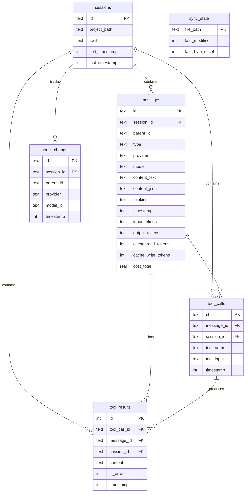

# Pi Session Analytics

[](https://viteplus.dev)
[](https://vitest.dev)

Archive [pi.dev](https://pi.dev) agent sessions in SQLite. Query your
session history, token usage, tool calls, cost, and model switches.

This project is a fork of
[pirecall](https://github.com/spences10/pirecall) by Scott Spence. It
keeps the original MIT license and copyright notice.

## Quick Start

Use `pi-session-analytics` inline in Pi sessions. Tell the agent:

```
"run npx pi-session-analytics sync then show me my top 5 projects by token usage"

"use npx pi-session-analytics search to find sessions where we discussed database migrations"

"run npx pi-session-analytics stats and tell me how much I've spent this week"
```

The agent runs the command, gets structured output, and can answer
follow-up questions about your session history.

## Resumable session index

Pi Session Analytics remains an archive: deleting a Pi JSONL session
does not delete its history from the database. Each sync additionally
records source-file metadata and marks missing sources as unavailable.
Resume integrations query only live sources:

```bash
pi-session-analytics resumable --scope all --limit 100 --json
pi-session-analytics resumable --scope project --cwd "$PWD" --query auth --json
```

The command returns a versioned object containing `schema_version`,
`capabilities`, and compact `sessions`. Node integrations can use the
same contract without relying on internal SQLite tables:

```ts
import { list_resumable_sessions } from 'pi-session-analytics/resumable';

const result = await list_resumable_sessions({
	scope: 'project',
	cwd: process.cwd(),
	query: 'auth',
	limit: 50,
});
```

Results contain the absolute JSONL `path`; integrations should verify
it still exists immediately before asking Pi to switch sessions.
Existing databases are migrated additively when opened. Run
`pi-session-analytics sync --json` once after upgrading to stream and
backfill session names and source metadata. The backfill is marked
complete per file, so later syncs remain incremental.

## How It Works

Pi stores sessions as JSONL files in `~/.pi/agent/sessions/`. During
sync, Pi Session Analytics first preserves every selected session in
an owner-only, content-addressed archive at
`~/.pi/pi-session-analytics/archive/`, then parses it into SQLite.
Older archive generations remain available when Pi rewrites or deletes
the source. Use `sync --archive <path>` to choose another archive
location.

SQLite table `session_records` keeps every archived JSONL record with
its raw JSON, tree IDs, generation, source path, and exact byte range.
Related `record_content_blocks`, `record_tool_calls`, and
`record_tool_results` rows keep common fields directly queryable while
IDs remain scoped to their source session.

**Step 1.** Sync your sessions:

```bash
npx pi-session-analytics sync
```

**Step 2.** Pi Session Analytics incrementally imports new content and
reports what it found:

```
Synced 24 sessions, 136 messages, 22 tool calls, 59 model changes
```

**Step 3.** Query the database with `pi-session-analytics` or raw SQL:

```bash
npx pi-session-analytics stats
npx pi-session-analytics search "database migration"
npx pi-session-analytics query "SELECT project_path, SUM(cost_total) FROM sessions s JOIN messages m ON m.session_id = s.id GROUP BY project_path ORDER BY 2 DESC LIMIT 5"
```

> **Important:** The agent doesn't know about `pi-session-analytics`
> unless you mention it. Mention
> `{npx,pnpx,bunx} pi-session-analytics` and the agent will discover
> subcommands and flags from the CLI output.

## Commands

```bash
npx pi-session-analytics sync                  # Import sessions (incremental)
npx pi-session-analytics stats                 # Session/message/token/cost counts
npx pi-session-analytics sessions              # List recent sessions
npx pi-session-analytics resumable --json      # List live sessions for resume UIs
npx pi-session-analytics verify --deep          # Verify database and archived bytes
npx pi-session-analytics search <term>         # Full-text search across all archived records
npx pi-session-analytics tools                 # Tool calls, failures, and argument shapes
npx pi-session-analytics recoveries            # Inferred same-turn recovery sequences
npx pi-session-analytics usage                 # Recorded tokens and cost comparisons
npx pi-session-analytics recall <term>         # LLM-optimised context retrieval
npx pi-session-analytics query "<sql>"         # Read-only SQL against the database
npx pi-session-analytics schema                # Show database table structure
npx pi-session-analytics compact               # Prune old tool results
```

All commands support `--json` for programmatic output and
`-d, --db <path>` to use a custom database path (default:
`~/.pi/pi-session-analytics.db`).

`search --json` returns
`{ schema_version, kind, query, count, results }`; every result
includes the source path, archive generation, record type, and byte
range. `query --json` returns
`{ schema_version, kind, sql, columns, count, rows }`. Both envelopes
use `schema_version: 1`, including empty results.

Tool reports use canonical archived records:

```bash
npx pi-session-analytics tools                       # calls and recorded outcomes
npx pi-session-analytics tools failures              # grouped recorded errors
npx pi-session-analytics tools arguments             # argument keys and value-free shapes
npx pi-session-analytics tools --provider openai --model gpt-5.4 --after 2026-09-01
```

Every report accepts `--project`, `--session`, `--provider`,
`--model`, `--after`, and `--before`. JSON output uses the versioned
`tool-summary`, `tool-failures`, or `tool-arguments` envelope. Failure
and argument groups include exact canonical record and archive byte
provenance. Argument reports keep keys and data types, not argument
values.

Reports use each source's effective history: append generations add
only their suffix, while a rewrite replaces the earlier snapshot. This
keeps archived history intact without counting unchanged calls twice.
A missing result is reported as incomplete, never guessed to be a
failure.

Recovery reports are deliberately labelled **inferred**. For each
recorded tool failure, the report looks only until the next user
message. It prefers the first successful retry of the same tool, then
the first successful alternate tool, and otherwise reports the failure
as unresolved. It reports intervening tool calls and exact provenance;
it does not claim intent, causation, or time-to-recovery.

```bash
npx pi-session-analytics recoveries --group model
npx pi-session-analytics recoveries --group project --after 2026-09-01
```

Recovery comparisons can group by model, provider, project, tool, or
UTC day.

Usage reports sum only the token and cost fields recorded by Pi:

```bash
npx pi-session-analytics usage --group model
npx pi-session-analytics usage --group provider
npx pi-session-analytics usage --group project
npx pi-session-analytics usage --group day --after 2026-09-01 --before 2026-10-01
npx pi-session-analytics usage --group model --details --json
```

The same time, session, project, provider, and model filters are
available for `recoveries` and `usage`. Usage can include every
contributing archive record with `--details`. Reports count priced and
unpriced messages separately; cost is `null` when no contributing
message recorded one. Missing prices are not looked up or estimated,
and event timestamps are not presented as exact active-session
duration.

## Sync checkpoints and verification

Sync commits each selected session source with its archive generation,
legacy compatibility rows, canonical records, and sync state. If the
process stops, the next sync reuses every committed source and
continues with the rest.

For an isolated import, pass
`sync --sessions <root> --archive <root> --db <file>`.

```bash
npx pi-session-analytics verify
npx pi-session-analytics verify --deep
npx pi-session-analytics verify --deep --json
```

The normal check covers SQLite integrity, foreign keys, current
generation links, canonical indexing, FTS row counts, and report
provenance. `--deep` also hashes every content-addressed chunk,
reconstructs and hashes every generation, compares every source still
present with its current generation, and rejects missing or untracked
chunk files. A failed check sets a non-zero exit status.

## Schema migrations

`src/schema.sql` creates the base database schema. `src/schema.ts`
loads that file, checks `PRAGMA user_version`, and transactionally
applies newer SQL files from `src/migrations/`. Builds copy the schema
and migrations into `dist`. Older unversioned Pi Session Analytics
databases are detected and adopted without deleting archive data.

## Database Schema



### Model/Provider Tracking

Tracks mid-session model switches from `~/.pi/agent/sessions/`. Pi
Session Analytics records every switch with its provider and model ID.

**Why track model changes?**

- See which models you actually use vs which you think you use
- Compare cost across providers for similar tasks
- Debug sessions where model switches caused behaviour changes

## Example Queries

```sql
-- Cost by session
SELECT s.project_path, s.id, SUM(m.cost_total) as cost
FROM sessions s
JOIN messages m ON m.session_id = s.id
GROUP BY s.id
ORDER BY cost DESC
LIMIT 10;

-- Token usage by day
SELECT DATE(timestamp/1000, 'unixepoch') as day,
  SUM(input_tokens + output_tokens) as tokens,
  ROUND(SUM(cost_total), 4) as cost
FROM messages
GROUP BY day
ORDER BY day DESC;

-- Model usage across providers
SELECT provider, model_id, COUNT(*) as switches
FROM model_changes
GROUP BY 1, 2
ORDER BY switches DESC;

-- Most used models
SELECT model, COUNT(*) as count
FROM messages
WHERE model IS NOT NULL
GROUP BY model
ORDER BY count DESC;

-- Tool usage breakdown
SELECT tool_name, COUNT(*) as count
FROM tool_calls
GROUP BY tool_name
ORDER BY count DESC;

-- Files read in a session
SELECT tc.tool_name, json_extract(tc.tool_input, '$.file_path') as file
FROM tool_calls tc
WHERE tc.tool_name = 'read' AND tc.session_id = 'your-session-id';

-- Cost by provider
SELECT m.provider, ROUND(SUM(m.cost_total), 4) as cost,
  SUM(m.input_tokens + m.output_tokens) as tokens
FROM messages m
WHERE m.provider IS NOT NULL
GROUP BY m.provider
ORDER BY cost DESC;
```

## Requirements

- Node.js 22+

## License

MIT
